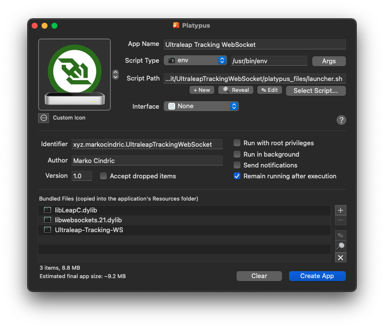

<p align="center"></p>

# Ultraleap Tracking WebSocket

This modified fork of Ultraleap Tracking WebSocket restores communication between [LeapJS](https://github.com/leapmotion/leapjs)-based projects and Leap Motion Controllers on **macOS** following the removal of WebSocket support from Ultraleap's official software. The end result is a binary wrapped as a macOS `.app` for easy deployment.

To use the prebuilt version, simply download the `.dmg` from this repository's [Releases](https://github.com/JaneTingley/UltraleapTrackingWebSocket/releases), or read on to build from source.

Note that **LeapJS also requires patching** to restore working WebSocket connectivity; see [this Gist](https://gist.github.com/MarkoCindric-xyz/82c4e920d1cc76affbae88831eba694c) for more information.

## Confirmed Working Build Requirements

The prebuilt `.dmg` was built using:

- CMake 4.3.3
- Ultraleap Hyperion v6.2.0
- libwebsockets v4.5.8
- Platypus 5.5.0

## Build Overview

1. Ensure that CMake is installed; it is available via [Homebrew](https://brew.sh/).

2. Download and install the latest version of [Ultraleap's official software](https://www.ultraleap.com/downloads/leap-controller/) based on your macOS architecture (Intel / Apple Silicon).

3. Download the source code of the latest stable build of [libwebsockets](https://github.com/warmcat/libwebsockets/tags).

4. Build libwebsockets **with SSL support disabled**.

5. Clone this repository.

6. Build Ultraleap Tracking WebSocket, pointing it to your custom libwebsockets build.

7. Download and install [Platypus](https://sveinbjorn.org/platypus), a software for wrapping command line scripts into macOS application bundles.

8. Configure and create a macOS app bundle using Platypus.
   - Set the "Script Path" to the `platypus_files/launcher.sh` file included in this repository.

   - Ensure that `libLeapC.dylib`, `libwebsockets.21.dylib`, and `Ultraleap-Tracking-WS` (all found in the `build` directory created in step 6) are added to the "Bundled Files" section of the Platypus configuration.

9. Use Disk Utility or the `hdiutil` command line tool to package the `.app` in a `.dmg` for easy distribution.

## Build (Detail)

1. Ensure that **CMake** is installed. This can be done using [Homebrew](https://brew.sh/).
   - To install Homebrew, open a terminal and run the following command:

   ```sh
   /bin/bash -c "$(curl -fsSL https://raw.githubusercontent.com/Homebrew/install/HEAD/install.sh)"
   ```

   - To install CMake, once Homebrew is installed, run:

   ```sh
   brew install cmake
   ```

2. From [Ultraleap's official website](https://www.ultraleap.com/downloads/leap-controller/), find and retrieve the latest version of their official Leap Motion Controller software for your Mac's particular architecture (Intel / Apple Silicon). Ensure that the software installs to the default `/Applications` directory.

   This step is necessary because the macOS version of the LeapSDK is bundled within the resulting `Ultraleap Hand Tracking.app`.

3. Download and extract the source code of the latest stable version of **libwebsockets** from its [GitHub repository](https://github.com/warmcat/libwebsockets/tags).

4. Build **libwebsockets** without SSL support. In a terminal, navigate to the directory where you extracted its source code and run the following commands:

```sh
mkdir build && cd build
cmake .. -DLWS_WITH_SSL=OFF
make -j $(sysctl -n hw.logicalcpu)
```

5. Clone this repository.

6. Build Ultraleap Tracking WebSocket, specifying the location of your custom libwebsockets build. In a terminal, navigate to the directory where you cloned this repository and run the following commands. Replace `'/absolute/path/to/libwebsockets/build'` with the path to your libwebsockets `build` directory.
   - _On macOS, you can right-click on any folder in Finder, hold down the Option key, and click `Copy "FolderName" as Pathname` to easily retrieve a pasteable absolute path._

```sh
mkdir build && cd build
cmake -DLWS_CUSTOM_ROOT='/absolute/path/to/libwebsockets/build' ..
make -j $(sysctl -n hw.logicalcpu)
```

7. Download and install [Platypus](https://sveinbjorn.org/platypus), a free and open-source software tool for wrapping command line scripts into macOS application bundles.

8. Open Platypus and proceed to configure and create a macOS app bundle.

   `platypus_files/launcher.sh` (in this repository) is a helper script that launches the `Ultraleap-Tracking-WS` binary built in step 6 as a background process and redirects its console messages to `~/Library/Logs/UltraleapTrackingWebSocket.log`. It also ensures that the binary's background execution is stopped when the app bundle is quitted by the user (i.e. after right-clicking its icon in the macOS dock and selecting "Quit"). **This will serve as the base script for the Platypus app bundle.**

   Using the below screenshot as a reference, configure Platypus, ensuring that:
   - **Script Path** has been set to `platypus_files/launcher.sh` using the **Select Script...** button.

   - **Interface** has been set to **None**.

   - `lipLeapC.dylib`, `libwebsockets.21.dylib`, and `Ultraleap-Tracking-WS` have all been added to **Bundled Files (copied into the application's Resources folder)** via the **+** button. These should all be found in the `build` directory created in step 6.

   An optional (but helpful for identification) app icon can be set using the button next to **Custom Icon**, choosing **Select Image File...** and selecting the `icon.png` file provided in this respository's `platypus_files` directory.

   When completed, click **Create App** and save the app bundle to a directory of your choosing. Ensure that **Create symlink to script and bundled files** IS NOT checked and that **Strip nib file to reduce app size** IS checked.



9. Use Disk Utility or the `hdiutil` command line tool to package the `.app` in a `.dmg` for easy distribution.
   - If using Disk Utility, first place the app bundle created in step 8 in its own directory, then in Disk Utility select **File → New Image → Image from Folder...** and choosing that directory. Ensure that **Encryption** is set to "none" and **Image Format** is set to "compressed," then click **Save** to create your `.dmg`.

   - If using `hdiutil`, open a terminal window and run the following command. Replace `'/absolute/path/to/bundled.app'` with the path to the app bundle created in step 8, and `'/absolute/output/path/UltraleapTrackingWebSocket.dmg'` with your desired output path (including the disk image's name and `.dmg` extension).

   ```sh
   hdiutil create -volname 'Ultraleap Tracking WebSocket' -srcfolder '/absolute/path/to/bundled.app' -ov -format UDZO '/absolute/output/path/UltraleapTrackingWebSocket.dmg'
   ```
